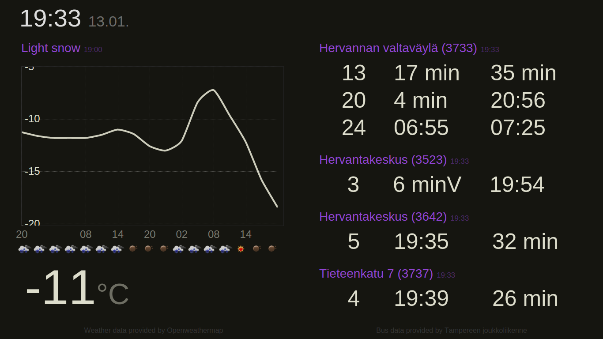

# Radiate

A simple information radiator displaying local weather forecast and next departing buses. Entirely non-responsive, handcrafted for a 1366x768 tablet.

## Getting started

Backend server:

    sudo apt-get install pip
    cd radiate-server/
    sudo pip install -r requirements.txt
    gunicorn apiserver:app

Frontend running on a "kiosk-mode" browser:

    sudo apt-get install google-chrome x11-xserver-utils, unclutter
    # allow all users to start X session
    sudo dpkg-reconfigure x11-common
    cd radiate-client/
    ./radiate-client.sh

To start the services non-interactively on server boot, see the [Upstart examples](tools/upstart/).

## Contributing

Pull requests, especially new plugins are welcome.

## Known issues

When using Flask's own debug web server, it is easy to get `error: [Errno 32] Broken pipe` with several requests. [The fix](http://stackoverflow.com/questions/12591760/flask-broken-pipe-with-requests) is to use a real WSGI server like [gunicorn](http://gunicorn.org/).
